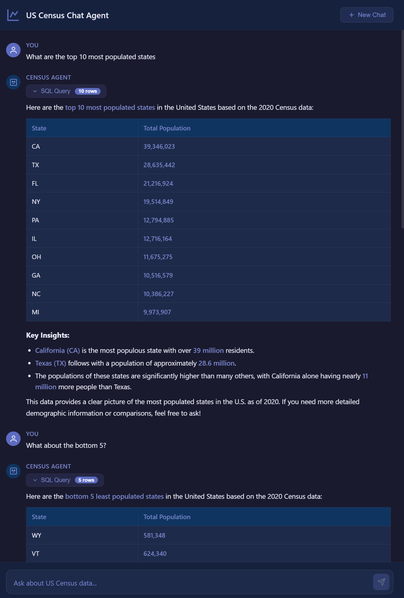

# US Census Chat Agent

An interactive chat agent that answers natural language questions about US population data, powered by the **SafeGraph US Open Census** dataset on Snowflake Marketplace.

## Live Demo

> **URL:** https://cencus-chat-agent.onrender.com/
>
> ⚠️ **Cold start notice:** Hosted on Render's free tier, which spins down the instance after ~15 minutes of inactivity. The **first request after a cold start can take up to 50 seconds** to wake the container, reconnect to Snowflake, and warm the schema cache. Subsequent requests respond normally (typically 10–15s). If the first load hangs, wait for the initial response — it's not broken, just cold.



## Architecture

```
┌──────────────┐    SSE     ┌──────────────────────────────────────────┐
│  React SPA   │◄───────────│              FastAPI Backend             │
│  (Vite/TS)   │  POST/SSE  │                                          │
└──────────────┘            │  Guardrails ──► SQL Gen ──► Safety Check │
                            │                     │                    │
                            │                     ▼                    │
                            │                Snowflake                 │
                            │                     │                    │
                            │                     ▼                    │
                            │            Response Stream (LLM)         │
                            └─────────────────────┬────────────────────┘
                                                  │
                                                  ▼
                                        US Open Census Data
                                      (Snowflake Marketplace)
```

## How It Works

1. **User sends a question** via the React chat UI (SSE streaming).
2. **Topic guardrail** — fast keyword check first; LLM classification only for ambiguous inputs.
3. **Question-aware schema context** — keyword-ranked tables + filtered ACS field descriptions (not the whole schema).
4. **SQL generation** — LLM converts NL to Snowflake SQL with conversation history (including prior SQL for coherent follow-ups).
5. **Safety validation** — regex validator blocks INSERT/UPDATE/DELETE/DROP/multi-statement SQL.
6. **Deterministic SQL cleanup** — post-processor wraps UNION/INTERSECT/EXCEPT arms in parentheses for Snowflake syntax.
7. **Snowflake execution** — runs in a worker thread (`asyncio.to_thread`) so the event loop stays responsive.
8. **Retry on SQL error** — if Snowflake rejects the query, the LLM sees the error and retries once.
9. **Response generation** — LLM streams a natural-language explanation of the results.
10. **Session management** — in-memory sessions with TTL; cancellable mid-stream via the UI stop button.

## Design Decisions

| Decision | Rationale |
|---|---|
| **Text-to-SQL, not pre-built queries** | Handles any question the data supports; scales beyond hardcoded templates |
| **Dynamic schema discovery + caching** | No schema drift; adapts if the dataset changes. 1hr TTL, question-aware filtering |
| **ACS field descriptions in context** | SafeGraph column names are cryptic codes (`B19013e1`); descriptions are the "Rosetta Stone" |
| **Keyword-ranked schema** | 42K-token full schema wouldn't fit; ranking surfaces relevant tables/columns first |
| **Retry-on-SQL-error** | LLMs hallucinate column names; feeding the error back usually produces a correct fix |
| **Deterministic UNION wrapping** | LLMs inconsistently follow "wrap each arm in parens" — a regex post-processor is reliable |
| **Two-phase guardrails** | Fast keyword check covers ~90% of cases; LLM fallback for ambiguous inputs |
| **SSE over WebSocket** | Simpler for request-response; tokens stream as they're generated |
| **Per-step timeouts** (`asyncio.wait_for`) | Bounds non-streaming LLM calls (topic 15s, SQL-gen 45s, SQL-fix 30s); streaming has no cap |
| **`asyncio.to_thread` for Snowflake** | Sync connector calls run in a thread pool; the event loop isn't blocked |
| **In-memory sessions** | Acceptable for demo; TTL-based expiration; `SessionStore` is swappable for Redis |
| **Stateful multi-turn with SQL-aware history** | Two history accessors: plain history for response generation; SQL-inclusive history for SQL generation. Lets the LLM build on prior queries (e.g., "now the bottom 5") without reasoning from scratch. |
| **Pluggable LLM provider** | OpenAI and Anthropic share a `Protocol` — config-driven switch |

## Tech Stack

- **Backend:** Python 3.12, FastAPI, Pydantic, sse-starlette
- **Frontend:** React 18, TypeScript, Vite
- **Database:** Snowflake (via `snowflake-connector-python`)
- **LLM:** OpenAI (default `gpt-4o-mini`) or Anthropic Claude
- **Deployment:** Docker, Render

## Project Structure

```
.
├── backend/
│   ├── app/
│   │   ├── config.py              # Pydantic Settings
│   │   ├── main.py                # FastAPI app + lifespan
│   │   ├── models/schemas.py      # Request/response models
│   │   ├── routers/chat.py        # /api/chat, /api/health
│   │   └── services/
│   │       ├── guardrails.py          # Topic + SQL safety checks
│   │       ├── llm.py                 # OpenAI/Anthropic providers
│   │       ├── response_generator.py  # Streams NL answer from results
│   │       ├── schema_cache.py        # Keyword-ranked schema + ACS descriptions
│   │       ├── session.py             # In-memory session store
│   │       ├── snowflake_client.py    # Query execution + sanitization
│   │       └── sql_generator.py       # NL→SQL + retry-fix + UNION wrapper
│   └── tests/           # 104 tests — see REFLECTION.md for breakdown
├── frontend/
│   ├── src/
│   │   ├── App.tsx + App.css      # Main UI (dark theme)
│   │   ├── hooks/useChat.ts       # SSE parser + state + cancel logic
│   │   └── components/            # ChatWindow, InputBar, MessageBubble
│   └── index.html, package.json, vite.config.ts
├── Dockerfile                     # Multi-stage build (Node → Python)
├── docker-compose.yml
└── render.yaml                    # Render deployment config
```

## Local Development

### Prerequisites
- Python 3.12+
- Node.js 20+
- Snowflake account with the **SafeGraph US Open Census Data** dataset installed from Marketplace
- OpenAI or Anthropic API key

### Setup

```bash
git clone <repo-url>
cd cencus-chat-agent
cp .env.example .env              # Edit with your credentials

# Python environment
python -m venv .venv && source .venv/bin/activate
pip install -r backend/requirements.txt

# Node modules
cd frontend && npm install && cd ..
```

### Running (two terminals)

```bash
# Terminal 1 — Backend
source .venv/bin/activate
uvicorn backend.app.main:app --reload --port 8000

# Terminal 2 — Frontend (dev server with live reload)
cd frontend && npm run dev
# Open http://localhost:3000
```

**Alternative:** after `cd frontend && npm run build`, visit http://localhost:8000 for the production build served by FastAPI.

### Running Tests

```bash
pytest backend/tests -v
pytest backend/tests --cov=backend/app --cov-report=term-missing
```

## API Endpoints

### `POST /api/chat`

Send a chat message, receive an SSE stream.

**Request:**
```json
{ "message": "What are the top 10 most populated states?", "session_id": "optional-uuid" }
```

**SSE events:**

| Event | Data | Description |
|---|---|---|
| `thinking` | status text | Pipeline progress update |
| `sql` | SQL string | Generated query (shown in collapsible UI section) |
| `data` | row count | Number of result rows |
| `answer_token` | token | Streamed response chunk |
| `answer` | full text | Complete answer (non-streaming fallback / error explanations) |
| `session_id` | UUID | Session identifier (store and send back for multi-turn) |
| `error` | text | User-friendly error (styled red in UI) |
| `done` | empty | Stream complete |

### `GET /api/health`

```json
{ "status": "healthy", "snowflake_connected": true, "llm_provider": "openai" }
```

## Example Questions

- "What are the top 10 most populated states?"
- "What is the median household income by state?"
- "What is the average age of people in California?"
- "Which state has the highest and lowest population?"
- "What percentage of households have no vehicle by state?"

### Multi-turn example

The agent preserves conversation context. After "Top 5 populated states" you can ask:

- "What about the bottom 5?" → LLM sees the previous SQL and reverses `ORDER BY` + swaps `DESC` for `ASC`
- "Now break that down by age" → LLM joins the B01 age/sex table
- "Show the same for 2019 instead" → LLM swaps `2020_CBG_B01` for `2019_CBG_B01`

Sessions have a 30-minute sliding TTL and retain the last 20 messages. The `session_id` is returned in the SSE stream and echoed back by the client automatically.

## Environment Variables

| Variable | Required | Default | Description |
|---|---|---|---|
| `SNOWFLAKE_ACCOUNT` | Yes | — | Account identifier (e.g., `ORGID-ACCOUNTID`) |
| `SNOWFLAKE_USER` | Yes | — | Snowflake username |
| `SNOWFLAKE_PASSWORD` | Yes | — | Snowflake password |
| `SNOWFLAKE_DATABASE` | No | `US_OPEN_CENSUS_DATA` | Database name |
| `SNOWFLAKE_SCHEMA` | No | `PUBLIC` | Schema name |
| `SNOWFLAKE_WAREHOUSE` | No | `COMPUTE_WH` | Warehouse name |
| `SNOWFLAKE_ROLE` | No | `ACCOUNTADMIN` | Role name |
| `LLM_PROVIDER` | No | `openai` | `openai` or `anthropic` |
| `OPENAI_API_KEY` | If OpenAI | — | OpenAI API key |
| `OPENAI_MODEL` | No | `gpt-4o-mini` | OpenAI model. **Recommended** for new accounts — the schema prompt is ~12k tokens, and `gpt-4o` free-tier has a 30k TPM cap which fails on longer conversations. `gpt-4o-mini` has ~200k TPM and is cheaper. |
| `ANTHROPIC_API_KEY` | If Anthropic | — | Anthropic API key |
| `ANTHROPIC_MODEL` | No | `claude-sonnet-4-20250514` | Anthropic model |
| `SNOWFLAKE_QUERY_TIMEOUT` | No | `50` | Snowflake STATEMENT_TIMEOUT in seconds (per-query cap) |
| `SESSION_TTL_MINUTES` | No | `30` | Session sliding TTL |
| `MAX_HISTORY` | No | `20` | Max messages retained per session |
| `APP_TITLE` | No | `US Census Chat Agent` | Shown in the FastAPI docs title |
| `CORS_ORIGINS` | No | `localhost:3000,localhost:5173` | Comma-separated allowed origins for cross-origin requests. Leave empty if frontend is served from the same origin. |
| `DEBUG` | No | `false` | Enable debug logging (verbose, including prompt contents — do not enable in production) |
